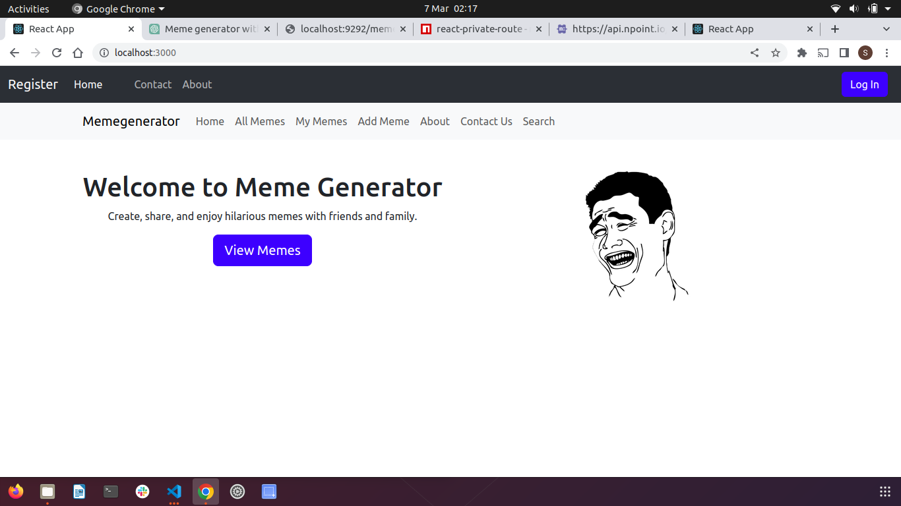

# Meme Generator Frontend
This is the frontend for the Meme Generator project. It allows users to register, login, and create, view, update, and delete memes.

## Here is my link to my backend and live deployed link for the application
 - [Live link](https://meme-generator-shipwoli.vercel.app)
 
 - [Backend repository](https://github.com/Shipwoli/Memes-generator-backend)

 - [Frontend repository](https://github.com/Shipwoli/meme-generator)

# Technologies Used
This project was built with React, Bootstrap, and Axios.

# Getting Started
To run the project locally, follow these steps:

1. Clone the repository to your local machine.
2. Navigate to the project directory.
3. Run npm install to install the project dependencies.
4. Run npm start to start the development server.

# Features
- User authentication: Users can register and login to the application.
- Create meme: Users can create a new meme by adding a title, image URL, and date published.
- View my memes: Users can view all the memes they have added.
- View all memes: Users can view all the available memes.
- Search memes: Users can search for memes by title or date published.
- Update meme: Users can update the details of a meme they added.
- Delete meme: Users can remove a meme they added.

# Ovaview of user interface by screen shot

# Code Structure
The code for the frontend is organized into several directories and files:

src/App.js: The main component that handles the routing of the application.
src/components: Contains the various components used in the application, such as Login, Register, Header, and AddMeme.
src/utils: Contains utility functions used in the application, such as the PrivateRoute component for handling user authentication.

# Future Improvements
Some possible future improvements to the application include:

* Implementing user roles to restrict certain actions to certain users (e.g. only allowing the creator of a meme to update or delete it).
* Adding image upload functionality so that users can upload images from their devices instead of having to provide image URLs.
* Improving the search functionality to allow for more advanced search options, such as searching by tags or categories.

# Contributing
If you would like to contribute to the project, feel free to fork the repository and submit a pull request with your changes.

# Credits
This project was created as part of a coding exercise by Khalwale Saviour

# License
This project is licensed under the MIT license.